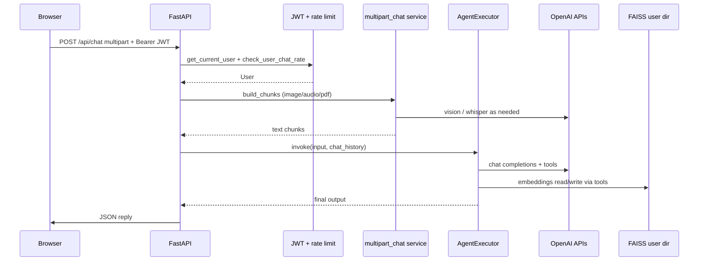

# Architecture (v2)

## Stack

| Layer | Technology |
| ----- | ---------- |
| HTTP API | FastAPI |
| Auth | JWT (python-jose), bcrypt passwords |
| Users | SQLAlchemy + SQLite (default) or PostgreSQL via `DATABASE_URL` |
| Chat agent | LangChain classic — `create_tool_calling_agent` + `AgentExecutor` |
| Personalization | `app/personalization.py` injects FAISS hits before each turn; `WEAKNESS:` / `GOAL:` / `STRENGTH:` in Save_memory get priority |
| Long-term memory | FAISS + OpenAI embeddings, **one index directory per `user_id`** |
| Short-term memory | In-process deque keyed by `(user_id, session_id)` |
| Multimodal | OpenAI vision (image → description), Whisper (audio → text), pypdf (PDF text) |
| Rate limiting | IP windows for register/login; rolling per-minute counter per user for chat |
| Frontend | Static HTML (`index`, `login`, `register`, `chat`) + shared CSS/JS |

---

## Request flow (chat)

---

## Isolation

- **User A** never reads **User B**’s FAISS: tools call `get_memory_store(user_id)`.
- **AgentExecutor** is cached **per `user_id`** so tool closures stay bound to the correct store.

---

## Data on disk (`data/`)

| Path | Content |
| ---- | ------- |
| `tutor.db` | SQLite users (unless `DATABASE_URL` points elsewhere) |
| `faiss_users/<id>/` | Serialized FAISS index for that user |

`data/` should be backed up if you care about accounts and long-term memory.

---

## Related docs

- [API.md](./API.md) — endpoints and examples
- [TROUBLESHOOTING.md](./TROUBLESHOOTING.md)
- [DEPLOYMENT.md](./DEPLOYMENT.md)
- [README.md](../README.md) — overview and roadmap
